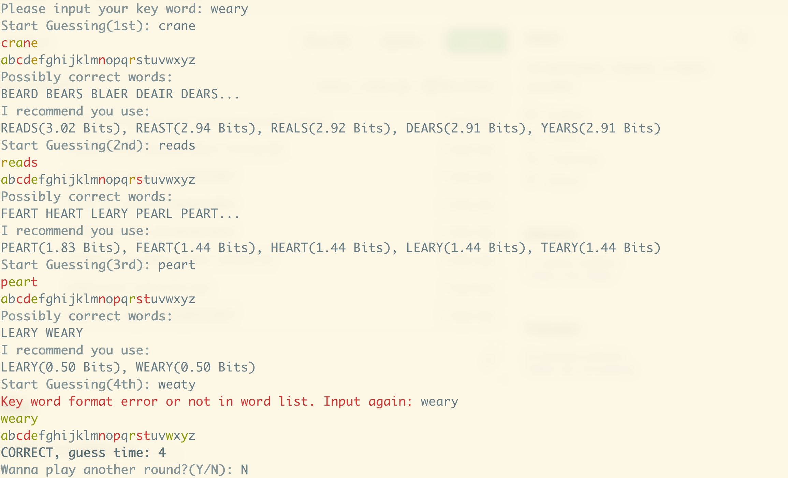

# Introduction
This is a simple wordle game written in Rust.
You can get the information below by running `wordle --help`:
```
USAGE:
    wordle [OPTIONS]

OPTIONS:
    -a, --acceptable-set <acceptable_set_file>
            The file of the acceptable set of the key word.

    -c, --config <config>
            The config file of input args.

    -d, --day <day>
            The day that you wanna start your game.

    -D, --difficult
            Toggle to turn on difficult mode.

    -f, --final-set <final_set_file>
            The file of the final set of the key word.

    -h, --help
            Print help information

    -r, --random
            Toggle to turn on random key word mode.

    -s, --seed <seed>
            The random seed for generating a key word.

    -S, --state <state_file>
            The game state file to load previous games.

    -t, --stats
            Toggle to output your stats of the game after every single round.

    -V, --version
            Print version information

    -w, --word <key_word>
            The key word for specifying the answer.
```
# Installation
## Requirement
Use `cargo` to build the project easily.

Install the rust package manager `cargo` with `curl --proto '=https' --tlsv1.2 -sSf https://sh.rustup.rs | sh` .
## Build
Clone this repo with `git clone https://github.com/hjsjhn/SimpleWordle.git` and simply use `cargo build --release` to get a binary file `target/release/wordle`.
# Features
There is a word recommender that recommend you the next word you should guess.

Also there's a wordle-solver program inside, you can build the file `src/wordle-solver` and use it.
# Screenshot

